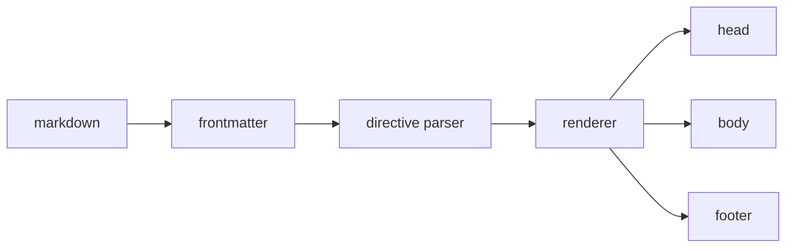

To integrate the multiselect with HTML forms you set the `name` attribute. The
component keeps a hidden input in sync as the selection changes.

:::callout{type=info title="Setup"}
This whole page is **one markdown file**. The demo below is a *real*
`<web-multiselect>` loaded from the CDN — selecting items runs live JS and prints
the value the server would receive. Press <kbd>Esc</kbd> to close the dropdown.
:::

## FI01 — JSON Format (default)

:::showcase{title="FI01 JSON Format (Default)" subtitle="Hidden input with a JSON array value"}

Prose written directly inside a showcase spans the full row — it is neither dropped
nor turned into a stray grid cell.

:::col{title="Demo"}
```html demo
<web-multiselect name="languages" value-format="json"
  data-options="JavaScript,TypeScript,Python,Go,Rust,Elixir"></web-multiselect>
```
```js run
el.addEventListener('change', (e) => out({ selected: e.detail, value: el.value }));
```
:::

:::col{title="Controls"}
Select items to see how the hidden input updates. On submit, the server parses one field:

```js
app.post('/submit', (req, res) => {
  const langs = JSON.parse(req.body.languages);
});
```
:::

:::col{title="Description"}
Creates a **single** hidden input containing a JSON array. Best for modern
backends that expect JSON.

```html
<input type="hidden" name="languages" value='["js","ts"]'>
```
:::

:::

## Big demos want more room

Some components (trees, grids) need most of the width. Layout is a generic
primitive — this is an **80/20** split, impossible with a 12-column grid:

:::columns{cols="80/20"}

:::col{title="Demo"}
```html demo
<web-multiselect value-format="csv"
  data-options="Prague,Vienna,Berlin,Warsaw,Budapest,Bratislava,Ljubljana"></web-multiselect>
```
:::

:::col{title="Notes"}
Typeahead search, keyboard nav, CSV value format — all from attributes.
:::

:::

And the full source of a demo can span the whole page underneath it:

```svelte example
<script>
  import '@keenmate/web-multiselect';
</script>

<web-multiselect
  value-format="csv"
  data-options="Prague,Vienna,Berlin" />
```

## Documenting the authoring syntax itself

A longer fence wraps a shorter one, so the docs can show their own markup verbatim
without the inner fence closing the outer block:

````md example
Wrap a demo in a fence and flag it:

```html demo
<web-multiselect data-options="a,b,c"></web-multiselect>
```
````

## How a page is rendered



## When a demo needs a real app

Most demos are markup plus a CDN web component. When one genuinely needs a compiled
front end with a server bridge, mount a **keen-phoenix-svelte island** — every part
named explicitly:

:::app{name="org-browser" component="tree"}

:::props
```json
{ "org_id": 42, "depth": 3 }
```
:::

:::placeholder
Loading the org browser…
:::

:::

The wrapper carries the same contract `<.app>` renders, and the page picks up a
`keen-apps` manifest plus a module preload for each island it mounts. In this
standalone POC no bundle is served, so the placeholder is what you see.

## Value formats

| `value-format` | Hidden input value | Use when |
| --- | --- | --- |
| `json` | `["js","ts"]` | modern JSON backends |
| `csv`  | `js,ts`        | classic form posts |
| `array`| `js` + `ts` (multiple inputs) | PHP-style `name[]` |

:::card{title="Tip"}
`:::col` is a plain labelled column (no box). `:::card` — like this one — is the
boxed variant, and it can sit **inside** a column.
:::

:::callout
A directive with no attributes at all is valid — this callout defaults to the `info`
type.
:::

:::columns

:::col{title="Equal columns"}
Omitting `cols=` gives every column the same width.
:::

:::col{title="No ratio needed"}
Useful when the split is even and you do not want to think about it.
:::

:::
